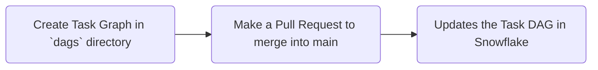

# Snowflake Task DAGs API Demo

**Disclaimer**: This is meant to be a demo of what you can do on Snowflake to integrate the Task DAG API with your version control system. This is **NOT** intended to be your production solution. I encourage you to take inspiration here!

## Task DAGs API Overview

The Task DAGs API allows you to create **Sequences of Tasks** with **Dependencies**. These tasks allow you to define in Code and schedule:

- Executing SQL
- Executing Python Code
- Executing Stored Procedures
- Doing anything you could do in Snowflake

## Integration with Github Actions for CI/CD

This Repository takes the Task DAGs API and integrates it with **Github Actions**, to re-create each Task DAG in Snowflake whenever it is updated in main.

This is so we can **manage our tasks as code** in a central **version-controlled location**, and still **schedule everything on the data, where it lives**.

## Quick look through what's here

- `auth/`
    - This directory contains the `snowflake_auth.py` module, which allows you to authorize locally, or deployed with credentials stored as environment variables.
    - Feel free to swap this part out if you are, for example, using AWS Secrets Manager.

- `sql/`
    - This directory is created for cleanliness to hold any SQL code you might want to execute in your DAGs. It doesn't have to be here, but it is probably cleaner to have all of your SQL in separate `.sql` files instead of in-python-script.
    - The utility function `utils.load_sql` takes either an absolute path, or a relative path (from the `sql/` directory) to the SQL file you want to load.

- `dags/`
    - This is where you'll put the DAGs. Take a look at `dags/dag_sample.py` for an example of what a DAG should look like, and also the docs [here](https://docs.snowflake.com/en/developer-guide/snowflake-python-api/snowflake-python-managing-tasks#creating-a-task-graph) for refernce.

- `.github/`
    - This is the folder holding the github actions.
    - Within it, you'll find `run_snowflake_dags.yml` which runs `create_dags.sh`:
        - This picks up all of the python files in the `dags/` folder, and tries to re-create the DAGs on a successful PR.
        - For DAGs that changed, this would mean that they would be updated to reflect the latest version of the code.
    - Otherwise, the `run_snowflake_dags.yml` file just specifies that we should run a shell script on a push to main, with a `python=3.8` container and the specified requirements.
        

